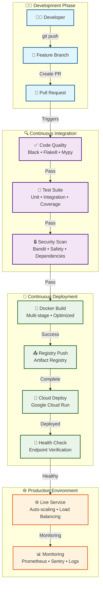
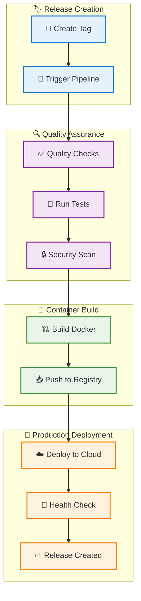

<div align="center">


# Ashes Project Django REST & GraphQL API Boilerplate

<div align="center">

**A production-ready Django API template with REST and GraphQL endpoints**

</div>

<div align="center">

[](https://codecov.io/gh/YOUR_USERNAME/dwml-backend-django)
[](https://www.python.org/downloads/)
[](https://www.djangoproject.com/)

</div>

<div align="center">

[](https://www.docker.com/)
[](https://github.com/psf/black)
[](https://opensource.org/licenses/MIT)
[](http://makeapullrequest.com)

</div>

</div>

---

## Table of Contents

- [Overview](#overview)
- [Key Features](#key-features)
- [System Architecture](#system-architecture)
- [Quick Start](#quick-start)
- [Installation Options](#installation-options)
- [Testing](#testing)
- [Code Quality](#code-quality)
- [Security](#security)
- [CI/CD Pipeline](#cicd-pipeline)
- [Available Commands](#available-commands)
- [Deployment](#deployment)
- [Monitoring](#monitoring)
- [API Documentation](#api-documentation)
- [Project Structure](#project-structure)
- [Contributing](#contributing)
- [Troubleshooting](#troubleshooting)
- [License](#license)

---

## Overview

A Django REST API boilerplate designed for rapid development of production-ready web APIs.

This template provides everything you need to build scalable, maintainable web APIs with Django. It includes features like automated testing, CI/CD pipelines, security scanning, monitoring, and deployment automation.

### API Architecture

The boilerplate supports both **REST** and **GraphQL** endpoints, giving you flexibility in how you interact with your API:

- **REST API**: Traditional HTTP endpoints with JSON responses
- **GraphQL**: Flexible query language for efficient data fetching
- **OpenAPI Documentation**: Interactive API documentation for both interfaces

### Feature Overview

| **Development** | **Testing** | **Deployment** |
|:---|:---|:---|
| Pre-commit hooks | Unit tests | Docker containers |
| Code formatting | Integration tests | CI/CD pipeline |
| Type checking | Coverage reporting | Cloud deployment |
| Linting | Test automation | Health monitoring |

---

## Key Features

| **Architecture** | **Security** | **Monitoring** | **Performance** |
|:---|:---|:---|:---|
| Clean Architecture | Security Scanning | Prometheus Metrics | Redis Caching |
| Service Layer | Dependency Checks | Structured Logging | Database Optimization |
| Dependency Injection | Authentication | Error Tracking | API Rate Limiting |

### Feature Categories

<details>
<summary><b>Development Experience</b></summary>

- ✅ **Code Quality**: Black, Flake8, isort, Mypy
- ✅ **Pre-commit Hooks**: Automated code quality checks
- ✅ **Type Checking**: Full mypy type annotations
- ✅ **IDE Support**: VS Code, PyCharm configurations
- ✅ **Hot Reload**: Development server with auto-reload

</details>

<details>
<summary><b>Testing & Quality</b></summary>

- ✅ **Testing**: Pytest with 80%+ coverage
- ✅ **Test Types**: Unit, integration, and API tests
- ✅ **Coverage**: Automated coverage reporting
- ✅ **Quality Gates**: Pre-commit quality checks
- ✅ **Performance**: Load testing capabilities

</details>

<details>
<summary><b>Security & Compliance</b></summary>

- ✅ **Security Scanning**: Bandit security analysis
- ✅ **Dependency Checks**: Safety vulnerability scanning
- ✅ **Authentication**: JWT, API Key, Session auth
- ✅ **Authorization**: Role-based access control
- ✅ **Data Protection**: Input validation and sanitization

</details>

<details>
<summary><b>Production Ready</b></summary>

- ✅ **Containerization**: Multi-stage Docker builds
- ✅ **CI/CD Pipeline**: GitHub Actions automation
- ✅ **Monitoring**: Prometheus metrics, Sentry integration
- ✅ **Logging**: Structured JSON logging
- ✅ **Health Checks**: Automated health monitoring
- ✅ **Scaling**: Horizontal scaling support

</details>

---

## System Architecture

### CI/CD Pipeline Flow




---

## Quick Start

### Get up and running in 5 minutes!

### Prerequisites

- **Python 3.10+**
- **pip or Pipenv**
- **Git**
- **Docker (optional)**

### Step-by-Step Setup

<details>
<summary><b>1. Clone the Repository</b></summary>

```bash
# Clone the repository
git clone <repository-url>
cd dwml-backend-django

# Navigate to project directory
cd dwml-backend-django
```

</details>

<details>
<summary><b>2. Set Up Development Environment</b></summary>

```bash
# Install dependencies and setup pre-commit hooks
make install-dev

# This will:
# ✅ Install all Python dependencies
# ✅ Set up pre-commit hooks
# ✅ Configure development tools
# ✅ Set up code quality tools
```

</details>

<details>
<summary><b>3. Configure Environment</b></summary>

```bash
# Copy environment template
cp env.example .env

# Edit .env with your settings
nano .env  # or use your preferred editor
```

**Required Environment Variables:**
```bash
SECRET_KEY=your-secret-key-here
DEBUG=True
ALLOWED_HOSTS=localhost,127.0.0.1
DATABASE_URL=sqlite:///db.sqlite3
```

</details>

<details>
<summary><b>4. Run Database Migrations</b></summary>

```bash
# Run Django migrations
make migrate

# This will:
# ✅ Create database tables
# ✅ Apply all migrations
# ✅ Set up initial data
```

</details>

<details>
<summary><b>5. Start Development Server</b></summary>

```bash
# Start the development server
make runserver

# The API will be available at:
# http://localhost:8000
# API Docs: http://localhost:8000/api/docs/
# Health Check: http://localhost:8000/api/v1/health/
```

</details>

---

## Installation Options

### Choose your preferred installation method

| **Make Commands** | **Docker Compose** | **Manual Installation** |
|:---|:---|:---|
| *Recommended* | *Containerized* | *Custom setup* |
| ```bash<br/>make install-dev<br/>``` | ```bash<br/>docker-compose up -d<br/>``` | ```bash<br/>pip install -r requirements.txt<br/>``` |
| ✅ Easy setup | ✅ Isolated environment | ✅ Full control |
| ✅ Automated configuration | ✅ Easy cleanup | ✅ Custom configuration |
| ✅ Pre-commit hooks | ✅ Production-like setup | ✅ Custom configuration |

### Docker Installation

<details>
<summary><b>Using Docker Compose (Recommended)</b></summary>

```bash
# Start all services
docker-compose up -d

# View logs
docker-compose logs -f web

# Stop services
docker-compose down
```

**Services included:**
- Web application (Django)
- Database (PostgreSQL/SQLite)
- Cache (Redis)
- Monitoring (Prometheus)

</details>

---

## Testing

### Testing Suite

| **Unit Tests** | **Integration Tests** | **Coverage Report** | **All Tests** |
|:---|:---|:---|:---|
| *Fast & Isolated* | *API & Database* | *Code Coverage* | *Complete Suite* |
| ```bash<br/>make test-unit<br/>``` | ```bash<br/>make test-integration<br/>``` | ```bash<br/>make coverage<br/>``` | ```bash<br/>make test<br/>``` |
| ✅ Model tests | ✅ API endpoint tests | ✅ Coverage metrics | ✅ Unit + Integration |
| ✅ Service tests | ✅ Database integration | ✅ HTML reports | ✅ Coverage reporting |
| ✅ Utility tests | ✅ External service tests | ✅ Coverage goals | ✅ Performance tests |

### Coverage Goals

| Component | Target | Current |
|:---|:---|:---|
| **Overall** | 80%+ | ✅ |
| **Critical Modules** | 90%+ | ✅ |
| **New Code** | 90%+ | ✅ |

---

## Code Quality

### Automated Code Quality Tools

| **Black** | **Flake8** | **isort** | **Mypy** | **Pre-commit** |
|:---|:---|:---|:---|:---|
| *Code Formatting* | *Linting* | *Import Sorting* | *Type Checking* | *Automated Hooks* |
| ```bash<br/>make format<br/>``` | ```bash<br/>make lint<br/>``` | ```bash<br/>make format<br/>``` | ```bash<br/>make lint<br/>``` | ```bash<br/>pre-commit install<br/>``` |
| ✅ Consistent formatting | ✅ Style guide compliance | ✅ Import organization | ✅ Type safety | ✅ Git hooks |
| ✅ Line length: 88 | ✅ Error detection | ✅ Group sorting | ✅ Static analysis | ✅ Auto-checks |
| ✅ Auto-formatting | ✅ Best practices | ✅ Auto-sorting | ✅ Error prevention | ✅ Quality gates |

---

## Security

### Security Measures

| **Bandit** | **Safety** | **Authentication** |
|:---|:---|:---|
| *Security Analysis* | *Dependency Scanning* | *Access Control* |
| ```bash<br/>make security-check<br/>``` | ```bash<br/>make security-check<br/>``` | ```bash<br/># JWT, API Key, Session<br/>``` |
| ✅ Security vulnerabilities | ✅ Known vulnerabilities | ✅ Multiple auth methods |
| ✅ Best practices | ✅ Dependency updates | ✅ Role-based access |
| ✅ Risk assessment | ✅ Security patches | ✅ Token management |

---

## CI/CD Pipeline

### Automated Deployment Pipeline

### Pipeline Stages

| **Quality Checks** | **Testing** | **Security** | **Deployment** |
|:---|:---|:---|:---|
| *Code Quality* | *Test Suite* | *Security Scanning* | *Production Release* |
| - Black formatting | - Unit tests | - Bandit security scan | - Docker build |
| - Flake8 linting | - Integration tests | - Safety dependency check | - Registry push |
| - Mypy type checking | - Coverage reporting | - Vulnerability assessment | - Cloud deployment |
| - isort import sorting | - Performance tests | - Security best practices | - Health verification |

### Pipeline Triggers

| **Branch Push** | **Pull Request** | **Tag Release** |
|:---|:---|:---|
| *Development* | *Code Review* | *Production* |
| ```bash<br/>git push origin main<br/>``` | ```bash<br/># Create PR to main<br/>``` | ```bash<br/>git tag prod/v1.0.0<br/>git push origin prod/v1.0.0<br/>``` |
| ✅ Quality checks | ✅ Quality checks | ✅ Full pipeline |
| ✅ Testing | ✅ Testing | ✅ Production deployment |
| ✅ Security scans | ✅ Security scans | ✅ Health verification |
| | ✅ Code review | ✅ Release creation |

---

## Available Commands

### Development Commands

| **Installation** | **Testing** | **Code Quality** |
|:---|:---|:---|
| ```bash<br/>make install<br/>make install-dev<br/>``` | ```bash<br/>make test<br/>make test-unit<br/>make test-integration<br/>make coverage<br/>``` | ```bash<br/>make format<br/>make lint<br/>make security-check<br/>``` |
| **Development** | **Utilities** | **Docker** |
| ```bash<br/>make runserver<br/>make migrate<br/>make clean<br/>``` | ```bash<br/>make help<br/>make pre-deploy<br/>``` | ```bash<br/>docker-compose up -d<br/>docker-compose down<br/>docker-compose logs<br/>``` |

---

## Deployment

### Production Deployment Guide

### Tag-Based Deployment

| **Create Release** | **Version Format** |
|:---|:---|
| ```bash<br/># Using release script<br/>./scripts/create-prod-release.sh 1.0.0<br/><br/># Or manually<br/>git tag -a prod/v1.0.0 -m "Release v1.0.0"<br/>git push origin prod/v1.0.0<br/>``` | ```bash<br/>prod/vMAJOR.MINOR.PATCH<br/><br/># Examples:<br/>prod/v1.0.0<br/>prod/v1.2.3<br/>prod/v2.0.0<br/>``` |

### Deployment Process



---

## Monitoring

### Production Monitoring

| **Prometheus** | **Sentry** | **Logging** |
|:---|:---|:---|
| *Metrics* | *Error Tracking* | *Structured Logs* |
| ```bash<br/>GET /metrics/<br/>``` | ```bash<br/># Automatic error reporting<br/>``` | ```bash<br/># JSON structured logging<br/>``` |
| ✅ Application metrics | ✅ Error monitoring | ✅ Request logging |
| ✅ Performance data | ✅ Performance tracking | ✅ Error logging |
| ✅ Custom metrics | ✅ Release tracking | ✅ Performance logs |

---

## API Documentation

### Interactive API Documentation

| **Swagger UI** | **OpenAPI Schema** | **Health Check** |
|:---|:---|:---|
| *Interactive Docs* | *API Specification* | *System Status* |
| ```bash<br/>http://localhost:8000/api/docs/<br/>``` | ```bash<br/>http://localhost:8000/api/schema/<br/>``` | ```bash<br/>http://localhost:8000/api/v1/health/<br/>``` |
| ✅ Interactive testing | ✅ Machine-readable | ✅ System health |
| ✅ Schema validation | ✅ Code generation | ✅ Service status |
| ✅ Request examples | ✅ Validation | ✅ Monitoring |

### Main Endpoints

| **Health** | **Documentation** | **Metrics** | **GraphQL** |
|:---|:---|:---|:---|
| ```bash<br/>GET /api/v1/health/<br/>``` | ```bash<br/>GET /api/docs/<br/>``` | ```bash<br/>GET /metrics/<br/>``` | ```bash<br/>POST /graphql/<br/>``` |

### Interacting with the Live System

Once deployed, you can interact with the system through multiple interfaces:

#### REST API
```bash
# Health check
curl https://your-domain.com/api/v1/health/

# API documentation
curl https://your-domain.com/api/docs/

# Example API call
curl -X GET "https://your-domain.com/api/v1/calculations/?symbol=BTC&investment=1000"
```

#### GraphQL
```bash
# GraphQL endpoint
curl -X POST https://your-domain.com/graphql/ \
  -H "Content-Type: application/json" \
  -d '{"query": "{ __schema { types { name } } }"}'
```

#### Interactive Documentation
- **Swagger UI**: `https://your-domain.com/api/docs/` - Interactive REST API testing
- **GraphQL Playground**: `https://your-domain.com/graphql/` - GraphQL query interface

---

## Project Structure

### Organized Codebase

```
dwml-backend-django/
├── backend/                 # Django application
│   ├── api/                # API app
│   │   ├── models/         # Data models
│   │   ├── serializers/    # API serializers
│   │   ├── services/       # Business logic
│   │   ├── views/         # API views
│   │   └── utils/         # Utility functions
│   ├── config/            # Django settings
│   └── shared/            # Shared components
├── tests/                 # Test suites
├── docs/                  # Documentation
├── scripts/               # Deployment scripts
├── .github/workflows/     # CI/CD pipelines
├── Dockerfile            # Container configuration
├── compose.yaml          # Docker Compose
└── Makefile             # Development commands
```

---

## Contributing

### How to Contribute

| **1. Fork & Clone** | **2. Create Branch** | **3. Make Changes** | **4. Submit PR** |
|:---|:---|:---|:---|
| ```bash<br/>git clone <your-fork><br/>cd dwml-backend-django<br/>``` | ```bash<br/>git checkout -b feature/your-feature<br/>``` | ```bash<br/># Make your changes<br/>make format<br/>make lint<br/>make test<br/>``` | ```bash<br/>git push origin feature/your-feature<br/># Create pull request<br/>``` |

### Code Standards

| **Style** | **Types** | **Testing** | **Documentation** |
|:---|:---|:---|:---|
| - PEP 8 compliance | - Type hints required | - Write tests | - Docstrings |
| - Black formatting | - Mypy compliance | - 80%+ coverage | - README updates |
| - 88 character limit | - Static analysis | - Test documentation | - Code comments |

---

## Troubleshooting

### Common Issues & Solutions

<details>
<summary><b>Pre-commit Hooks Failing</b></summary>

```bash
# Update pre-commit hooks
pre-commit autoupdate

# Run manually to see errors
pre-commit run --all-files

# Skip hooks temporarily
git commit --no-verify -m "message"
```

</details>

<details>
<summary><b>Tests Failing</b></summary>

```bash
# Run with verbose output
cd backend
pytest -vv --tb=long

# Run specific test
pytest tests/unit/test_models.py::TestResultsModel::test_create_result -v

# Run with coverage
pytest --cov=api --cov-report=html
```

</details>

<details>
<summary><b>Docker Issues</b></summary>

```bash
# Rebuild containers
docker-compose down
docker-compose build --no-cache
docker-compose up -d

# Check logs
docker-compose logs -f web

# Clean up
docker-compose down -v
docker system prune -a
```

</details>

<details>
<summary><b>Import Errors</b></summary>

```bash
# Check Python version
python --version  # Should be 3.10+

# Check installed packages
pip list

# Reinstall dependencies
make clean
make install-dev

# Check virtual environment
which python
which pip
```

</details>

---

## License

### MIT License

This project is licensed under the MIT License - see the [LICENSE](LICENSE) file for details.

