<div align="center">


# Ashes Project Django REST API Boilerplate

<div align="center">

**A production-ready Django REST API with simplified domain-driven design**

</div>

<div align="center">

[](https://codecov.io/gh/YOUR_USERNAME/dwml-backend-django)
[](https://www.python.org/downloads/)
[](https://www.djangoproject.com/)

</div>

<div align="center">

[](https://www.docker.com/)
[](https://github.com/psf/black)
[](https://opensource.org/licenses/MIT)
[](http://makeapullrequest.com)

</div>

</div>

---

## Table of Contents

- [Overview](#overview)
- [Key Features](#key-features)
- [System Architecture](#system-architecture)
- [Quick Start](#quick-start)
- [Installation Options](#installation-options)
- [Testing](#testing)
- [Code Quality](#code-quality)
- [Security](#security)
- [CI/CD Pipeline](#cicd-pipeline)
- [Available Commands](#available-commands)
- [Deployment](#deployment)
- [Monitoring](#monitoring)
- [API Documentation](#api-documentation)
- [Project Structure](#project-structure)
- [Contributing](#contributing)
- [Troubleshooting](#troubleshooting)
- [License](#license)

---

## Overview

A Django REST API designed for rapid development of production-ready web APIs, featuring a **simplified domain-driven design** architecture.

This template provides everything you need to build scalable, maintainable web APIs with Django. It includes features like automated testing, CI/CD pipelines, security scanning, monitoring, and deployment automation.

### API Architecture

The boilerplate uses a **simplified 2-app architecture**:

- **`domain` app**: All business logic, models, services, and endpoints in one place
- **`shared` app**: Cross-cutting concerns (exceptions, middleware)

**Key Features:**
- **REST API**: Clean HTTP endpoints with JSON responses
- **OpenAPI Documentation**: Interactive API documentation
- **Main Endpoint**: `process_request` for cryptocurrency portfolio calculations
- **Django-Idiomatic**: Follows Django best practices, not over-engineered

### Feature Overview

| **Development** | **Testing** | **Deployment** |
|:---|:---|:---|
| Pre-commit hooks | Unit tests | Docker containers |
| Code formatting | Integration tests | CI/CD pipeline |
| Type checking | Coverage reporting | Cloud deployment |
| Linting | Test automation | Health monitoring |

---

## Key Features

| **Architecture** | **Security** | **Monitoring** | **Performance** |
|:---|:---|:---|:---|
| Simple Domain Design | Security Scanning | Prometheus Metrics | Django Caching |
| Service Layer | Dependency Checks | Structured Logging | Database Optimization |
| Single Domain App | Authentication | Error Tracking | API Rate Limiting |

### Feature Categories

<details>
<summary><b>Development Experience</b></summary>

- ✅ **Code Quality**: Black, Flake8, isort, Mypy
- ✅ **Pre-commit Hooks**: Automated code quality checks
- ✅ **Type Checking**: Full mypy type annotations
- ✅ **IDE Support**: VS Code, PyCharm configurations
- ✅ **Hot Reload**: Development server with auto-reload

</details>

<details>
<summary><b>Testing & Quality</b></summary>

- ✅ **Testing**: Pytest with 80%+ coverage
- ✅ **Test Types**: Unit, integration, and API tests
- ✅ **Coverage**: Automated coverage reporting
- ✅ **Quality Gates**: Pre-commit quality checks
- ✅ **Performance**: Load testing capabilities

</details>

<details>
<summary><b>Security & Compliance</b></summary>

- ✅ **Security Scanning**: Bandit security analysis
- ✅ **Dependency Checks**: Safety vulnerability scanning
- ✅ **Authentication**: JWT, API Key, Session auth
- ✅ **Authorization**: Role-based access control
- ✅ **Data Protection**: Input validation and sanitization

</details>

<details>
<summary><b>Production Ready</b></summary>

- ✅ **Containerization**: Multi-stage Docker builds
- ✅ **CI/CD Pipeline**: GitHub Actions automation
- ✅ **Monitoring**: Prometheus metrics, Sentry integration
- ✅ **Logging**: Structured JSON logging
- ✅ **Health Checks**: Automated health monitoring
- ✅ **Scaling**: Horizontal scaling support

</details>

---

## System Architecture

### CI/CD Pipeline Flow

```mermaid
graph TB
    subgraph "👨‍💻 Development Phase"
        DEV[👨‍💻 Developer]
        FEATURE[🌿 Feature Branch]
        PR[📝 Pull Request]
    end
    
    subgraph "🔍 Continuous Integration"
        QUALITY[✅ Code Quality<br/>Black • Flake8 • Mypy]
        TEST[🧪 Test Suite<br/>Unit • Integration • Coverage]
        SECURITY[🔒 Security Scan<br/>Bandit • Safety • Dependencies]
    end
    
    subgraph "🚀 Continuous Deployment"
        BUILD[🐳 Docker Build<br/>Multi-stage • Optimized]
        PUSH[📤 Registry Push<br/>Artifact Registry]
        DEPLOY[🚀 Cloud Deploy<br/>Google Cloud Run]
        VERIFY[🏥 Health Check<br/>Endpoint Verification]
    end
    
    subgraph "🌐 Production Environment"
        PROD[🌐 Live Service<br/>Auto-scaling • Load Balancing]
        MONITOR[📊 Monitoring<br/>Prometheus • Sentry • Logs]
    end
    
    DEV -->|"git push"| FEATURE
    FEATURE -->|"Create PR"| PR
    PR -->|"Triggers"| QUALITY
    QUALITY -->|"Pass"| TEST
    TEST -->|"Pass"| SECURITY
    SECURITY -->|"Pass"| BUILD
    BUILD -->|"Success"| PUSH
    PUSH -->|"Complete"| DEPLOY
    DEPLOY -->|"Deployed"| VERIFY
    VERIFY -->|"Healthy"| PROD
    PROD -->|"Monitoring"| MONITOR
    
    classDef devPhase fill:#e1f5fe,stroke:#01579b,stroke-width:2px
    classDef ciPhase fill:#f3e5f5,stroke:#4a148c,stroke-width:2px
    classDef cdPhase fill:#e8f5e8,stroke:#1b5e20,stroke-width:2px
    classDef prodPhase fill:#fff3e0,stroke:#e65100,stroke-width:2px
    
    class DEV,FEATURE,PR devPhase
    class QUALITY,TEST,SECURITY ciPhase
    class BUILD,PUSH,DEPLOY,VERIFY cdPhase
    class PROD,MONITOR prodPhase
```




---

## Quick Start

### Get up and running in 5 minutes!

> **🎯 Architecture Note**: This project uses a **simplified 2-app structure** (`domain` + `shared`) instead of over-engineered bounded contexts. All business logic lives in the `domain` app, making it easy to understand and maintain. See [Project Structure](#project-structure) for details.

### Prerequisites

- **Python 3.10+**
- **pip or Pipenv**
- **Git**
- **Docker (optional)**

### Step-by-Step Setup

<details>
<summary><b>1. Clone the Repository</b></summary>

```bash
# Clone the repository
git clone <repository-url>
cd dwml-backend-django

# Navigate to project directory
cd dwml-backend-django
```

</details>

<details>
<summary><b>2. Set Up Development Environment</b></summary>

```bash
# Install dependencies and setup pre-commit hooks
make install-dev

# This will:
# ✅ Install all Python dependencies
# ✅ Set up pre-commit hooks
# ✅ Configure development tools
# ✅ Set up code quality tools
```

</details>

<details>
<summary><b>3. Configure Environment</b></summary>

```bash
# Copy environment template
cp env.example .env

# Edit .env with your settings
nano .env  # or use your preferred editor
```

**Required Environment Variables:**
```bash
SECRET_KEY=your-secret-key-here
DEBUG=True
ALLOWED_HOSTS=localhost,127.0.0.1
DATABASE_URL=sqlite:///db.sqlite3
```

</details>

<details>
<summary><b>4. Run Database Migrations</b></summary>

```bash
# Run Django migrations
make migrate

# This will:
# ✅ Create database tables
# ✅ Apply all migrations
# ✅ Set up initial data
```

</details>

<details>
<summary><b>5. Start Development Server</b></summary>

```bash
# Start the development server
make runserver

# The API will be available at:
# 🌐 Main API: http://localhost:8000/api/
# 📚 API Docs: http://localhost:8000/api/docs/
# 🏥 Health Check: http://localhost:8000/api/health/
```

</details>

<details>
<summary><b>6. Test the Main Endpoint</b></summary>

```bash
# Test the process_request endpoint (GET method)
curl "http://localhost:8000/api/process_request/?symbol=BTC&investment=1000"

# Or using POST method
curl -X POST http://localhost:8000/api/process_request/ \
  -H "Content-Type: application/json" \
  -d '{"symbol": "BTC", "investment": 1000}'

# Check health
curl http://localhost:8000/api/health/
# Expected: {"status":"healthy","service":"dwml-backend","version":"2.0.0"}
```

</details>

---

## Installation Options

### Choose your preferred installation method

| **Make Commands** | **Docker Compose** | **Manual Installation** |
|:---|:---|:---|
| *Recommended* | *Containerized* | *Custom setup* |
| ```bash<br/>make install-dev<br/>``` | ```bash<br/>docker-compose up -d<br/>``` | ```bash<br/>pip install -r requirements.txt<br/>``` |
| ✅ Easy setup | ✅ Isolated environment | ✅ Full control |
| ✅ Automated configuration | ✅ Easy cleanup | ✅ Custom configuration |
| ✅ Pre-commit hooks | ✅ Production-like setup | ✅ Custom configuration |

### Docker Installation

<details>
<summary><b>Using Docker Compose (Recommended)</b></summary>

```bash
# Start all services
docker-compose up -d

# View logs
docker-compose logs -f web

# Stop services
docker-compose down
```

**Services included:**
- Web application (Django)
- Database (PostgreSQL/SQLite)
- Cache (Redis)
- Monitoring (Prometheus)

</details>

---

## Testing

### Testing Suite

| **Unit Tests** | **Integration Tests** | **Coverage Report** | **All Tests** |
|:---|:---|:---|:---|
| *Fast & Isolated* | *API & Database* | *Code Coverage* | *Complete Suite* |
| ```bash<br/>make test-unit<br/>``` | ```bash<br/>make test-integration<br/>``` | ```bash<br/>make coverage<br/>``` | ```bash<br/>make test<br/>``` |
| ✅ Model tests | ✅ API endpoint tests | ✅ Coverage metrics | ✅ Unit + Integration |
| ✅ Service tests | ✅ Database integration | ✅ HTML reports | ✅ Coverage reporting |
| ✅ Utility tests | ✅ External service tests | ✅ Coverage goals | ✅ Performance tests |

### Coverage Goals

| Component | Target | Current |
|:---|:---|:---|
| **Overall** | 80%+ | ✅ |
| **Critical Modules** | 90%+ | ✅ |
| **New Code** | 90%+ | ✅ |

---

## Code Quality

### Automated Code Quality Tools

| **Black** | **Flake8** | **isort** | **Mypy** | **Pre-commit** |
|:---|:---|:---|:---|:---|
| *Code Formatting* | *Linting* | *Import Sorting* | *Type Checking* | *Automated Hooks* |
| ```bash<br/>make format<br/>``` | ```bash<br/>make lint<br/>``` | ```bash<br/>make format<br/>``` | ```bash<br/>make lint<br/>``` | ```bash<br/>pre-commit install<br/>``` |
| ✅ Consistent formatting | ✅ Style guide compliance | ✅ Import organization | ✅ Type safety | ✅ Git hooks |
| ✅ Line length: 88 | ✅ Error detection | ✅ Group sorting | ✅ Static analysis | ✅ Auto-checks |
| ✅ Auto-formatting | ✅ Best practices | ✅ Auto-sorting | ✅ Error prevention | ✅ Quality gates |

---

## Security

### Security Measures

| **Bandit** | **Safety** | **Authentication** |
|:---|:---|:---|
| *Security Analysis* | *Dependency Scanning* | *Access Control* |
| ```bash<br/>make security-check<br/>``` | ```bash<br/>make security-check<br/>``` | ```bash<br/># JWT, API Key, Session<br/>``` |
| ✅ Security vulnerabilities | ✅ Known vulnerabilities | ✅ Multiple auth methods |
| ✅ Best practices | ✅ Dependency updates | ✅ Role-based access |
| ✅ Risk assessment | ✅ Security patches | ✅ Token management |

---

## CI/CD Pipeline

### Automated Deployment Pipeline

### Pipeline Stages

| **Quality Checks** | **Testing** | **Security** | **Deployment** |
|:---|:---|:---|:---|
| *Code Quality* | *Test Suite* | *Security Scanning* | *Production Release* |
| - Black formatting | - Unit tests | - Bandit security scan | - Docker build |
| - Flake8 linting | - Integration tests | - Safety dependency check | - Registry push |
| - Mypy type checking | - Coverage reporting | - Vulnerability assessment | - Cloud deployment |
| - isort import sorting | - Performance tests | - Security best practices | - Health verification |

### Pipeline Triggers

| **Branch Push** | **Pull Request** | **Tag Release** |
|:---|:---|:---|
| *Development* | *Code Review* | *Production* |
| ```bash<br/>git push origin main<br/>``` | ```bash<br/># Create PR to main<br/>``` | ```bash<br/>git tag prod/v1.0.0<br/>git push origin prod/v1.0.0<br/>``` |
| ✅ Quality checks | ✅ Quality checks | ✅ Full pipeline |
| ✅ Testing | ✅ Testing | ✅ Production deployment |
| ✅ Security scans | ✅ Security scans | ✅ Health verification |
| | ✅ Code review | ✅ Release creation |

---

## Available Commands

### Development Commands

| **Installation** | **Testing** | **Code Quality** |
|:---|:---|:---|
| ```bash<br/>make install<br/>make install-dev<br/>``` | ```bash<br/>make test<br/>make test-unit<br/>make test-integration<br/>make coverage<br/>``` | ```bash<br/>make format<br/>make lint<br/>make security-check<br/>``` |
| **Development** | **Utilities** | **Docker** |
| ```bash<br/>make runserver<br/>make migrate<br/>make clean<br/>``` | ```bash<br/>make help<br/>make pre-deploy<br/>``` | ```bash<br/>docker-compose up -d<br/>docker-compose down<br/>docker-compose logs<br/>``` |

---

## Deployment

### Production Deployment Guide

### Tag-Based Deployment

| **Create Release** | **Version Format** |
|:---|:---|
| ```bash<br/># Using release script<br/>./scripts/create-prod-release.sh 1.0.0<br/><br/># Or manually<br/>git tag -a prod/v1.0.0 -m "Release v1.0.0"<br/>git push origin prod/v1.0.0<br/>``` | ```bash<br/>prod/vMAJOR.MINOR.PATCH<br/><br/># Examples:<br/>prod/v1.0.0<br/>prod/v1.2.3<br/>prod/v2.0.0<br/>``` |

### Deployment Process

```mermaid
graph TB
    subgraph "🏷️ Release Creation"
        A[📝 Create Tag]
        B[🔄 Trigger Pipeline]
    end
    
    subgraph "🔍 Quality Assurance"
        C[✅ Quality Checks]
        D[🧪 Run Tests]
        E[🔒 Security Scan]
    end
    
    subgraph "🐳 Container Build"
        F[🏗️ Build Docker]
        G[📤 Push to Registry]
    end
    
    subgraph "🚀 Production Deployment"
        H[☁️ Deploy to Cloud]
        I[🏥 Health Check]
        J[✅ Release Created]
    end
    
    A --> B
    B --> C
    C --> D
    D --> E
    E --> F
    F --> G
    G --> H
    H --> I
    I --> J
    
    classDef releasePhase fill:#e3f2fd,stroke:#1976d2,stroke-width:2px
    classDef qualityPhase fill:#f3e5f5,stroke:#7b1fa2,stroke-width:2px
    classDef buildPhase fill:#e8f5e8,stroke:#388e3c,stroke-width:2px
    classDef deployPhase fill:#fff3e0,stroke:#f57c00,stroke-width:2px
    
    class A,B releasePhase
    class C,D,E qualityPhase
    class F,G buildPhase
    class H,I,J deployPhase
```



---

## Monitoring

### Production Monitoring

| **Prometheus** | **Sentry** | **Logging** |
|:---|:---|:---|
| *Metrics* | *Error Tracking* | *Structured Logs* |
| ```bash<br/>GET /metrics/<br/>``` | ```bash<br/># Automatic error reporting<br/>``` | ```bash<br/># JSON structured logging<br/>``` |
| ✅ Application metrics | ✅ Error monitoring | ✅ Request logging |
| ✅ Performance data | ✅ Performance tracking | ✅ Error logging |
| ✅ Custom metrics | ✅ Release tracking | ✅ Performance logs |

---

## API Documentation

### Interactive API Documentation

| **Swagger UI** | **OpenAPI Schema** | **Health Check** |
|:---|:---|:---|
| *Interactive Docs* | *API Specification* | *System Status* |
| ```bash<br/>http://localhost:8000/api/docs/<br/>``` | ```bash<br/>http://localhost:8000/api/schema/<br/>``` | ```bash<br/>http://localhost:8000/api/health/<br/>``` |
| ✅ Interactive testing | ✅ Machine-readable | ✅ System health |
| ✅ Schema validation | ✅ Code generation | ✅ Service status |
| ✅ Request examples | ✅ Validation | ✅ Monitoring |

### Main Endpoints

All endpoints are under `/api/`:

| **Category** | **Endpoint** | **Method** | **Description** |
|:---|:---|:---|:---|
| **Main** | `/api/process_request/` | GET, POST | Calculate portfolio value |
| **Portfolio** | `/api/results/` | GET | List portfolio results |
| **Portfolio** | `/api/results/<id>/` | GET | Get specific result |
| **Portfolio** | `/api/logs/` | GET | View audit logs |
| **Market Data** | `/api/price/current/` | GET | Get current price |
| **Market Data** | `/api/price/opening/` | GET | Get opening average |
| **Market Data** | `/api/price/history/` | GET | Get price history |
| **Analytics** | `/api/analytics/covid/` | GET | COVID impact analysis |
| **Analytics** | `/api/analytics/report/` | GET | Generate analytics report |
| **Health** | `/api/health/` | GET | Health check |
| **Metrics** | `/metrics/` | GET | Prometheus metrics |

### Using the Main Endpoint

The `process_request` endpoint is the core of the DWML application:

#### GET Method (Backwards Compatible)
```bash
curl "http://localhost:8000/api/process_request/?symbol=BTC&investment=1000"
```

#### POST Method (RESTful)
```bash
curl -X POST http://localhost:8000/api/process_request/ \
  -H "Content-Type: application/json" \
  -d '{"symbol": "BTC", "investment": 1000}'
```

#### Response Format
```json
{
  "id": 1,
  "symbol": "BTC",
  "investment": "1000.00",
  "number_coins": "0.02345678",
  "profit": "200.50",
  "growth_factor": "0.2005",
  "lambos": "0.00",
  "roi_percentage": "20.05",
  "is_profitable": true,
  "can_buy_lambo": false,
  "risk_level": "LOW",
  "generation_date": "2025-10-11T12:00:00Z"
}
```

### Other Example API Calls

```bash
# Health check
curl http://localhost:8000/api/health/

# Get portfolio results
curl http://localhost:8000/api/results/

# Get COVID analytics
curl http://localhost:8000/api/analytics/covid/

# Get current price
curl "http://localhost:8000/api/price/current/?symbol=BTC"
```

### Interactive Documentation
- **Swagger UI**: `http://localhost:8000/api/docs/` - Interactive REST API testing
- **OpenAPI Schema**: `http://localhost:8000/api/schema/` - Machine-readable API spec

---

## Project Structure

### Simplified Codebase Architecture

```
dwml-backend-django/
├── backend/                     # Django application
│   ├── domain/                  # 🎯 Main domain app (ALL business logic)
│   │   ├── models.py            # All 6 models (Portfolio, Market, Analytics)
│   │   ├── services.py          # All services and business logic
│   │   ├── views.py             # All 10 API endpoints
│   │   ├── serializers.py       # All request/response serialization
│   │   ├── urls.py              # URL routing
│   │   ├── admin.py             # Django admin configuration
│   │   └── migrations/          # Database migrations
│   ├── shared/                  # 🛠️ Shared utilities
│   │   ├── exceptions/          # Custom domain exceptions
│   │   │   └── custom_exceptions.py
│   │   └── middleware.py        # Domain exception middleware
│   └── config/                  # ⚙️ Django configuration
│       ├── settings.py          # Application settings
│       ├── urls.py              # Root URL configuration
│       └── wsgi.py / asgi.py    # WSGI/ASGI entry points
├── tests/                       # Test suites
│   ├── unit/                    # Unit tests
│   └── integration/             # Integration tests
├── docs/                        # Documentation
├── scripts/                     # Deployment scripts
├── .github/workflows/           # CI/CD pipelines
├── Dockerfile                   # Container configuration
├── compose.yaml                 # Docker Compose
├── Makefile                     # Development commands
└── IMPLEMENTATION_SUMMARY.md    # Architecture documentation
```

### Key Architecture Decisions

**Why Single Domain App?**
- ✅ **Simplicity**: All business logic in one place
- ✅ **Django-Idiomatic**: Follows Django conventions
- ✅ **Maintainability**: Easy to understand and modify
- ✅ **60% Less Code**: Removed over-engineered bounded contexts
- ✅ **Production Ready**: Still scalable when needed

**What's in the Domain App?**
- 📊 **6 Models**: PortfolioResult, PortfolioLog, OpeningAverage, MarketPrice, Prediction, AnalysisReport
- 🔧 **5 Services**: Portfolio, MarketData, Calculator, Analytics, CovidAnalyzer
- 🌐 **10 Endpoints**: Including main `process_request` endpoint
- 🎨 **8 Serializers**: All API request/response handling
- ⚡ **Kraken Client**: External API integration

**Architecture Evolution:**
This codebase was refactored from an over-engineered 3-bounded-context DDD implementation to a simpler, more maintainable structure. The result is:
- **60% less code** (from ~2000 to ~800 LOC)
- **75% fewer apps** (from 4 domain apps to 1)
- **Same functionality** with better maintainability
- See `IMPLEMENTATION_SUMMARY.md` for the full migration story

---

## Contributing

### How to Contribute

| **1. Fork & Clone** | **2. Create Branch** | **3. Make Changes** | **4. Submit PR** |
|:---|:---|:---|:---|
| ```bash<br/>git clone <your-fork><br/>cd dwml-backend-django<br/>``` | ```bash<br/>git checkout -b feature/your-feature<br/>``` | ```bash<br/># Make your changes<br/>make format<br/>make lint<br/>make test<br/>``` | ```bash<br/>git push origin feature/your-feature<br/># Create pull request<br/>``` |

### Code Standards

| **Style** | **Types** | **Testing** | **Documentation** |
|:---|:---|:---|:---|
| - PEP 8 compliance | - Type hints required | - Write tests | - Docstrings |
| - Black formatting | - Mypy compliance | - 80%+ coverage | - README updates |
| - 88 character limit | - Static analysis | - Test documentation | - Code comments |

---

## Troubleshooting

### Common Issues & Solutions

<details>
<summary><b>Pre-commit Hooks Failing</b></summary>

```bash
# Update pre-commit hooks
pre-commit autoupdate

# Run manually to see errors
pre-commit run --all-files

# Skip hooks temporarily
git commit --no-verify -m "message"
```

</details>

<details>
<summary><b>Tests Failing</b></summary>

```bash
# Run with verbose output
cd backend
pytest -vv --tb=long

# Run specific test
pytest tests/unit/test_models.py::TestResultsModel::test_create_result -v

# Run with coverage
pytest --cov=api --cov-report=html
```

</details>

<details>
<summary><b>Docker Issues</b></summary>

```bash
# Rebuild containers
docker-compose down
docker-compose build --no-cache
docker-compose up -d

# Check logs
docker-compose logs -f web

# Clean up
docker-compose down -v
docker system prune -a
```

</details>

<details>
<summary><b>Import Errors</b></summary>

```bash
# Check Python version
python --version  # Should be 3.10+

# Check installed packages
pip list

# Reinstall dependencies
make clean
make install-dev

# Check virtual environment
which python
which pip
```

</details>

---

## License

### MIT License

This project is licensed under the MIT License - see the [LICENSE](LICENSE) file for details.

